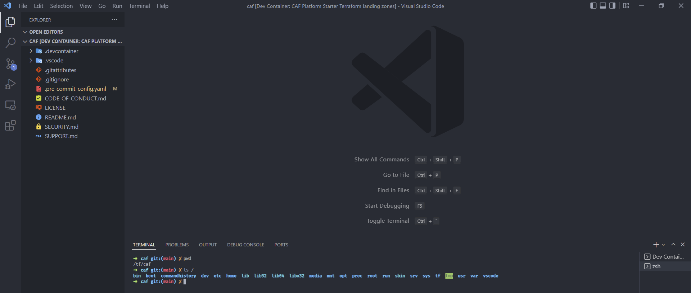

# Local Environment Setup

## Install Required Software
---

The first tasks you will need to perform involve installing the following required software packages to your development machine.  Move on to the [Repository Configuration](#repository-configuration) instructions when complete.
- Azure CLI: https://docs.microsoft.com/en-us/cli/azure/install-azure-cli
- IDE - We'll be using VSCode: https://code.visualstudio.com/download
- If using a Windows OS, you will need to configure Windows Subsystem for Linux and install Docker: https://docs.microsoft.com/en-us/windows/wsl/tutorials/wsl-containers
- Remote Development Extension Pack for VSCode: https://marketplace.visualstudio.com/items?itemName=ms-vscode-remote.vscode-remote-extensionpack


## Repository Configuration
---
Create forks of the following GitHub repositories
- https://github.com/Azure/caf-terraform-landingzones-platform-starter
- https://github.com/Azure/caf-terraform-landingzones

> This guide will use the sample GitHub account name of **tschwarz01** for purposes of illustration.  Make sure you update the relevant references with your own information if you decide to copy and paste from this guide.


## Clone caf-terraform-landingzones-platform-starter repository
---
Follow the next steps in the prescribed order.
1. Clone your fork of the platform starter repo to your local machine
2. Change directory into the freshly cloned local repository
3. Open VSCode
```bash
git clone https://github.com/[YOUR_ACCOUNT]/caf-terraform-landingzones-platform-starter
cd caf-terraform-landingzones-platform-starter
code .
```


1. VSCode should prompt you with a message stating 'Folder contains a Dev Container configuration file...', select Reopen in Container at this prompt.  The container may take a short time to fully initialize.  When it is complete, you should have a bash or zsh prompt visible in the terminal.


2. Take a moment to look around.  You should notice a few things.

There's not much here at the moment.  You should see only two directories containing configuration settings for the devcontainer and vscode.  Additionally, you'll see common markdown files & git related configuration files.

In the terminal, if you type "`pwd`", you'll see that the current directory context is `/tf/caf`

If you type "`ls /`" you'll see the directories and directory structure you'd expect from an Ubuntu based VM.

Feel free to explore. You'll notice that there several utilities which come pre-installed in this image, including Terraform, Ansible, Git and others. When you finish exploring, continue with step 6 below.



## Clone caf-terraform-landingzones repository

---

6. From the `/tf/caf` directory, clone the caf-terraform-landingzones fork you created previously to the /tf/caf/terraform directory.

```bash
git clone https://github.com/[YOUR_ACCOUNT]/caf-terraform-landingzones landingzones
```
7. Change your working directory via "`cd /tf/caf/landingzones`"
8. We may need to checkout a different working branch from the caf-terraform-landingzones.

> Example: `git checkout 2204.1.int`

> NOTE: The platform-starter-kit walkthrough often instructs users to checkout the latest YYMM branch.
At present, I've been using the branch 2204.1.int.  If this branch is no longer available when you are reading this, you can use "`git branch -r`" to view the list of remote branches.


## Next Steps

---

You've completed the necessary installations, forked the caf-terraform-landingzones git repositories and cloned those forks to your local development machine.  You've also launched the development container within VSCode.

- [Proceed with the CAF Custom Deployment walkthrough](L_custom_deploy.md)
- [Proceed with the CAF Platform Landing Zones Deployment walkthrough](L_platform_deploy.md)
